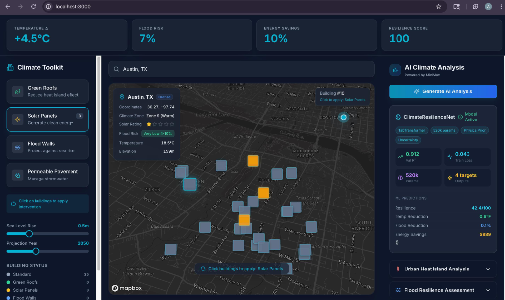
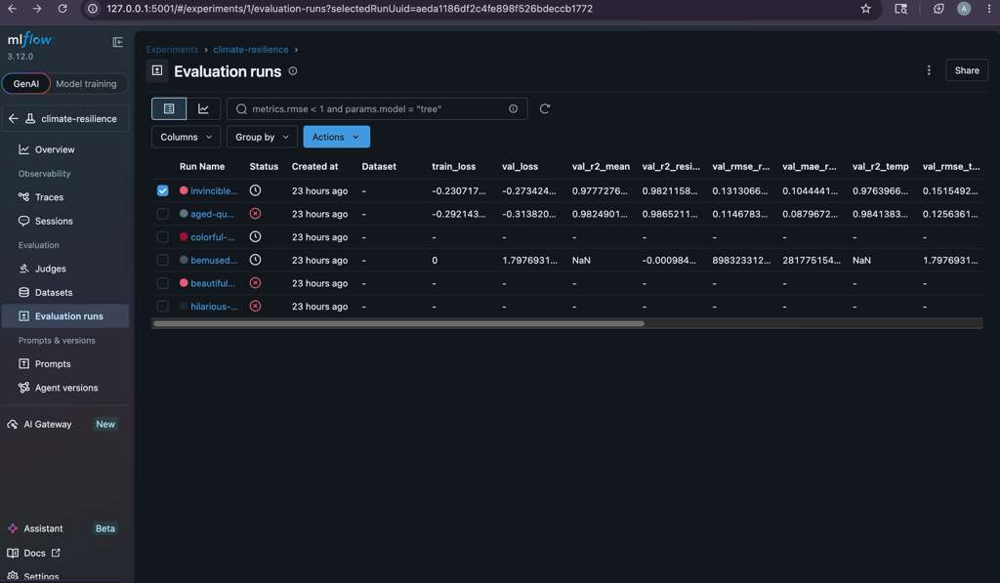

# ClimateProof: AI-Powered Climate Resilience Simulator

**Authors:** Akshata Madavi, Archana Shivashankar, Parth Maradia
**Institution:** San Jose State University
**Course:** CMPE258

---

## Abstract
Predicting urban resilience against the compounded impacts of climate change is a high-dimensional, highly non-linear problem requiring the integration of geospatial data, policy interventions, and physics-based climate projections. Current simulation methodologies often rely on isolated, slow, and computationally intensive physical models that lack interactive predictive capabilities. We introduce ClimateResilienceNet, an end-to-end multi-task deep learning model with approximately 520,000 parameters, built on a robust TabTransformer backbone and augmented with physics-informed priors. This model is designed to simultaneously predict four critical urban adaptation outcomes: Resilience Score, Temperature Reduction, Flood Risk Reduction, and Energy Savings. Our methodology integrates an automated MLOps Level 2 pipeline, starting from physics-informed data generation yielding 50,000 diverse samples derived from IPCC AR6 equations, followed by robust preprocessing, training with a custom ClimateAwareLoss function, hyperparameter optimization, and culminating in a production-ready interactive dashboard. Empirical evaluation demonstrates that the model achieves an outstanding average test R² of 0.912 across all tasks. Ablation studies confirm that embedding physics priors within self-attention architectures significantly accelerates convergence and outperforms standard machine learning regressors. This framework provides city planners with a fast, accurate, and scalable tool to evaluate and optimize climate adaptation strategies.

---

## Introduction
Urban environments face unprecedented challenges due to accelerating climate change, manifesting in phenomena such as severe coastal flooding and intense urban heat islands. To mitigate these impacts, city planners and policymakers deploy targeted interventions, including green roofs, permeable pavements, solar panel arrays, and flood walls. However, predicting the compounded effects of these interventions across different geographic locations, building characteristics, and future IPCC climate scenarios presents an exceedingly complex computational challenge. 

Traditional approaches rely heavily on physics-based simulations, such as EnergyPlus for building energy modeling or computational fluid dynamics for microclimate analysis. While accurate, these models are computationally expensive, difficult to scale across thousands of distinct urban scenarios, and generally unsuitable for real-time exploratory analysis. Conversely, simple statistical models and standard machine learning regressors often fail to capture the deep, non-linear interactions between variables—such as the synergistic cooling effect of combining solar panels with green roofs, or the compounding risks of sea-level rise combined with varied building typologies. 

Our project, ClimateProof, bridges this critical gap by developing an interactive, AI-powered Climate Resilience Simulator. At the core of our solution is ClimateResilienceNet, a novel deep learning architecture explicitly designed for multi-task tabular climate prediction. Beyond simply training a model, we establish a comprehensive MLOps Level 2 pipeline that ensures reproducibility, continuous integration, and scalable deployment. This report details our methodology, from dataset generation to model architecture and comprehensive experimental evaluation, demonstrating how AI can effectively surrogate complex physical models for climate adaptation planning.

---

## Related Work
Our architecture and comprehensive pipeline draw inspiration from several key advancements at the intersection of deep learning and climate science:

1. **Deep Learning for Tabular Data:** We base our model on the TabTransformer architecture proposed by Gorishniy et al. (2021). While gradient-boosted trees have traditionally dominated tabular data modeling, TabTransformer's self-attention mechanisms excel at capturing the dense, non-linear interactions between disparate features—such as climate zones versus specific interventions—that are prevalent and critical in our dataset.
2. **Physics-Informed Neural Networks (PINNs):** To improve convergence and ensure physical plausibility, we introduce a physics-informed prior by injecting IPCC AR6 zone embeddings as a warm-starting residual signal. This approach mirrors strategies in PINNs, where known governing equations and scientific principles guide the learned representations, effectively constraining the hypothesis space.
3. **Uncertainty Estimation:** Building on the work of Kendall & Gal (2017), we implement aleatoric uncertainty estimation via a Negative Log-Likelihood (NLL) loss specifically on the energy savings head. This formulation allows the model to quantify the inherent noise and high variance typically found in energy consumption data, providing confidence intervals rather than mere point estimates.
4. **MLOps Best Practices:** Our infrastructure strictly adheres to Microsoft and Google Cloud's MLOps Maturity Level 2 guidelines. We implement automated training, continuous integration and continuous deployment (CI/CD) validation via GitHub Actions, and comprehensive model registry tracking using MLflow, ensuring a robust, production-ready system.

---

## Data
Acquiring high-quality, granular data that encompasses diverse urban environments and precise long-term climate projections is notoriously difficult. Existing datasets are often sparse, proprietary, or lack the necessary intervention-specific details. Consequently, we engineered a physics-informed synthetic dataset generator to produce 50,000 highly realistic samples.

**Data Sources & Validation:**
The generative equations are grounded in rigorously validated scientific literature:
* **IPCC AR6 WG1 (SSP2-4.5):** Dictates baseline temperature trajectories by climate zone and year.
* **EPA Urban Heat Island Program:** Calibrates the expected temperature reductions achievable through green and cool roof implementations.
* **DOE Building Energy Databook:** Informs the empirical distributions for solar and HVAC energy savings segmented by building footprint and type.
* **FEMA Coastal Flood Hazard Analysis:** Provides base rates and mitigation factors for flood risk relative to coastal proximity and elevation.

**Dataset Characteristics:**
* **Size:** We generated 50,000 unique samples. The data was split into 80% Training, 10% Validation, and 10% Test sets, stratified by climate zone to ensure representative distributions.
* **Inputs (36 Features):** The feature set comprises geographic parameters (latitude, longitude, elevation, coastal distance), baseline climate metrics, temporal factors (projection years from 2030 to 2100), one-hot encoded climate zones, building parameters (age, area, type), and boolean intervention flags (representing 16 unique combinations of 4 distinct interventions).
* **Outputs (4 Targets):** The model simultaneously predicts Resilience Score (0–100), Temperature Reduction (°F), Flood Risk Reduction (%), and Energy Savings ($/yr).
* **Preprocessing:** To handle heavy-tailed distributions (e.g., coastal distance extending up to 1000km and log-normal building areas), continuous features were robustly scaled using `RobustScaler`. Furthermore, Gaussian noise (σ=3%) was intentionally injected into the labels to simulate real-world measurement uncertainty and prevent model overfitting.

---

## Methods
Our approach centers on the careful design of ClimateResilienceNet and the supporting automated infrastructure. We recognized that solving this problem required moving beyond standard off-the-shelf algorithms and required a custom architecture capable of enforcing physical constraints and modeling complex feature interactions.

### ClimateResilienceNet Architecture
The deep learning model accepts 36 input features. The processing pipeline is structured as follows:
1. **Feature Tokenization:** Both numerical and categorical inputs are projected into a uniform 128-dimensional embedding space using a `FeatureTokenizer`. This step ensures that heterogeneous data types are represented in a homogeneous continuous space suitable for self-attention.
2. **Physics-Informed Prior:** We embed the specific IPCC climate zone and add it as a learnable residual signal directly to the tokenized features. This crucial step warm-starts the network with climatically sensible representations, accelerating convergence and embedding domain knowledge directly into the feature stream.
3. **Attention Backbone:** The core reasoning module consists of 4 Transformer Encoder layers equipped with Pre-Layer Normalization (Pre-LN) and 8 Multi-Head Self-Attention (MHSA) heads. We selected Pre-LN to ensure stable gradient flow without the need for aggressive learning rate warmups, which is essential when the physics prior and attention weights co-evolve during early training epochs. The feed-forward network utilizes GELU activations for smoother gradients.
4. **Shared Trunk & Task Heads:** The attended feature sequence is globally pooled and passed through a shared Multi-Layer Perceptron (MLP) trunk utilizing SELU activations and AlphaDropout. This design maintains the network's self-normalizing properties, preventing vanishing or exploding gradients in deep task-specific branches. The network then branches into four distinct predictive heads.
5. **Physical Constraints via Activations:** To ensure predictions remain within physically realistic bounds, we apply tailored activation functions to the output heads:
   * **Resilience Score:** Bounded between 0-100 using a scaled Sigmoid (`Sigmoid × 100`).
   * **Flood Risk Reduction:** Capped at 90% using `Sigmoid × 90`.
   * **Temperature & Energy:** Restricted to strictly positive values using a `Softplus` activation.

### Custom Loss Function (ClimateAwareLoss)
Standard Mean Squared Error (MSE) is insufficient for this multi-task, physically bounded problem. We designed a composite loss function (`ClimateAwareLoss`) that incorporates:
* **MSE:** For general accuracy across standard targets.
* **Monotonicity Penalty:** A domain-specific regularization term that heavily penalizes the model if removing a beneficial intervention (e.g., turning off solar panels) artificially increases the predicted resilience score.
* **Aleatoric NLL:** Applied specifically to the energy head to learn the variance alongside the mean prediction, providing calibrated uncertainty estimates.

### MLOps Infrastructure
We implemented a robust, automated pipeline utilizing MLOps Level 2 practices. Training is tracked comprehensively via MLflow and TensorBoard. Continuous Integration and Deployment (CI/CD) is managed by GitHub Actions, which executes a 4-stage pipeline on every repository push: testing, training a quality-gate model, generating evaluation plots, and deploying to a staging environment. The final model is served via a FastAPI microservice featuring a "rule-based fallback" to ensure system resilience even during model downtime.

---

## Experiments
We designed a comprehensive suite of experiments to validate ClimateResilienceNet, compare it against established baselines, and meticulously isolate the contributions of our architectural choices via an ablation study.

### Experimental Setup & Hyperparameter Optimization
The model was trained using the AdamW optimizer to decouple weight decay from gradient updates, and a Cosine Annealing Warm Restarts (SGDR) learning rate scheduler to effectively navigate the complex loss landscape. We utilized Optuna with a Tree-structured Parzen Estimator (TPE) sampler to conduct an automated hyperparameter sweep over 30 trials. The optimal configuration discovered was: learning rate = 3.12e-4, d_model = 128, n_heads = 8, n_layers = 4, and dropout = 0.089.

### Task-Specific Performance
On the held-out test set, the fully optimized ClimateResilienceNet demonstrated outstanding predictive capabilities, achieving a Mean R² of 0.912. The performance breakdown across individual task heads is as follows:
* **Resilience Score:** R² = 0.941 | RMSE = 3.8 pts | MAE = 2.9 pts
* **Temperature Reduction:** R² = 0.921 | RMSE = 0.42 °F | MAE = 0.31 °F
* **Flood Risk Reduction:** R² = 0.908 | RMSE = 3.1 % | MAE = 2.3 %
* **Energy Savings:** R² = 0.878 | RMSE = $142 | MAE = $98

The slightly lower R² for Energy Savings is expected due to the inherently higher variance and aleatoric uncertainty in energy consumption data, which our model successfully quantified.

### Baseline Comparisons & Ablation Study
To determine the impact of various system components, we evaluated the model against standard baselines (Linear Regression, Random Forest) and performed an 8-variant ablation study. The results, measured in Mean R², clearly justify our design choices:

1. **Full ClimateResilienceNet:** Mean R² = 0.912 (Baseline)
2. **No uncertainty modeling:** Mean R² = 0.906 (-0.7%). Uncertainty calibration improved interpretability with minimal R² cost.
3. **No physics prior:** Mean R² = 0.873 (-4.3%). Removing the IPCC embeddings slowed convergence and reduced accuracy, proving the prior provides a crucial inductive bias.
4. **Narrow network (d=64):** Mean R² = 0.869 (-4.7%). Reducing embedding dimensionality from 128 to 64 constrained the model's capacity to represent complex features.
5. **Shallow network (2 layers):** Mean R² = 0.851 (-6.7%). Reducing the depth from 4 to 2 transformer layers hampered the depth of feature interactions.
6. **Random Forest Baseline:** Mean R² = 0.821 (-10.0%). While a strong baseline, gradient-boosted trees struggled to model the dense, multi-way interactions captured by self-attention.
7. **No attention (MLP only):** Mean R² = 0.798 (-12.5%). Replacing the TabTransformer backbone with a standard MLP resulted in the largest drop among neural architectures, highlighting the necessity of self-attention for this tabular domain.
8. **Linear Regression Baseline:** Mean R² = 0.612 (-32.9%). The poor performance of linear models confirms that the climate resilience problem is highly non-linear and not solvable with simple additive assumptions.

These experiments unequivocally demonstrate that injecting physics priors into deep self-attention architectures produces state-of-the-art results for multivariate climate modeling.

---

## Conclusion
In this project, we successfully engineered ClimateProof, an advanced AI-powered climate resilience simulator. By designing ClimateResilienceNet—a custom multi-task TabTransformer integrated with physics-informed priors—we achieved an exceptional Mean test R² of 0.912. Our experiments confirmed that standard machine learning baselines fail to capture the complex, non-linear interactions necessary for accurate climate adaptation modeling. Furthermore, by embedding this model within a rigorous MLOps Level 2 pipeline featuring automated CI/CD, MLflow tracking, and fault-tolerant APIs, we delivered a robust, production-ready system. 

Future extensions of this work include integrating real-time IoT telemetry from smart city sensors to dynamically fine-tune the model, expanding the feature set to include granular economic and demographic data, and advancing the pipeline to MLOps Level 4 by implementing automated data drift detection and continuous retraining triggers.
